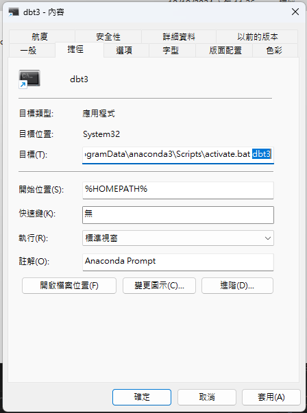

# `dbt-materialization` Quickstart

[](https://docs.getdbt.com/dbt-cli/cli-overview)
[](https://www.postgresql.org/)
[](https://www.python.org/)
[](https://www.docker.com/)

This is a `dbt-materialization` quickstart template, that supports PostgreSQL run with podman. This turtorial assumed viewer has basic DBT and Jinja knowledge. If not please have these lessons first.
  - [dbt-core-quickstart-template](https://github.com/saastoolset/dbt-core-quickstart-template)
  - [Jinja2-101-template](https://github.com/saastool/jinja2-101)
  
  This `dbt-materialization` taken from the various [dbt Developer Hub](https://docs.getdbt.com/guides/using-jinja) and the infrastructure is based on [dbt-core-quickstart-template](https://github.com/saastoolset/dbt-core-quickstart-template), using `PostgreSQL` as the data warehouse. 

  If you have finished dbt-core-quickstart-template before, the infrastructure and architect we using here are total the same. That is to say, you can skip directly to [Step 3 Create a project​](#3-create-a-project)

- [`dbt-core` Quickstart](#dbt-core-quickstart)
- [Steps](#steps)
  - [1 Introduction​](#1-introduction)
  - [2 Create a repository and env prepare​](#2-create-a-repository-and-env-prepare)
  - [3 Create a project​](#3-create-a-project)
  - [4 Connect to PostgreSQL​](#4-connect-to-postgresql)
- [Course](#course)
    - [1. what is materializations?](#1-what-is-materializations)
    - [2. Tables, views, and ephemeral models](#2-tables-views-and-ephemeral-models)
    - [3. Incremental models](#3-incremental-models) 


# Reference
+ [dbt course: advanced-materializations](https://learn.getdbt.com/courses/advanced-materializations)
+ dbt official doc
    + [Materializations](https://docs.getdbt.com/docs/build/materializations)
    + [Add snapshots to your DAG](https://docs.getdbt.com/docs/build/snapshots)

# Setup Steps

## [1 Introduction​](https://docs.getdbt.com/guides/manual-install?step=1)

This template will develop and run dbt commands using the dbt Cloud CLI — a dbt Cloud powered command line with PostgreSQL.

- Prerequisites
  - Python/conda
  - Podman desktop
  - DBeaver
  - git client
  - visual code
  
  - ***Windows***: Path review for conda if VSCode have python runtime issue. Following path needs add and move to higher priority.

  ```
  C:\ProgramData\anaconda3\Scripts
  C:\ProgramData\anaconda3
  ```
  
- Create a GitHub account if you don't already have one.


## [2 Create a repository and env prepare​](https://docs.getdbt.com/guides/manual-install?step=2)

1. Create a new GitHub repository

- Find our Github template repository [dbt-core-quickstart-template](https://github.com/saastoolset/dbt-core-quickstart-template)
- Click the big green 'Use this template' button and 'Create a new repository'.
- Create a new GitHub repository named **dbt-core-qs-ex1**.


2. Select Public so the repository can be shared with others. You can always make it private later.
2. Leave the default values for all other settings.
3. Click Create repository.
4. Save the commands from "…or create a new repository on the command line" to use later in Commit your changes.
5. Install and setup envrionment

- Create python virtual env for dbt
  - For venv and and docker, using the [installation instructions](https://docs.getdbt.com/docs/core/installation-overview) for your operating system.
  - For conda in **Mac**, open terminal as usual

    ```command
    (base) ~ % conda create -n jinja 
    (base) ~ % conda activate jinja
    ```
    
  - For conda in **Windows**, open conda prompt terminal in ***system administrador priviledge***

    ```command
    (base) C:> conda create -n dbt dbt-core dbt-postgres
    (base) C:> conda activate dbt
    ```
    
  - ***Windows***: create shortcut to taskbar
    - Find application shortcut location

    

    - Copy and rename shortcut to venv name
    - Change location parameter to venv name
    
    

    - Pin the shortcut to Start Menu


- Start up db and pgadmin
  . use admin/Password as connection
  
  - ***Windows***:
    
    ```
    (dbt) C:> cd C:\Proj\myProject\50-GIT\dbt-core-qs-ex1
    (dbt) C:> bin\db-start-pg.bat
    ```
    
  - ***Mac***:
    
    ```
    (dbt) ~ % cd ~/Projects/dbt-macros-packages/
    (dbt) ~ % source ./bin/db-start-pg.sh
    (dbt) ~ % source ./bin/db-pgadm.sh
    ``` 

## [3 Create a project​](https://docs.getdbt.com/guides/manual-install?step=3)

Make sure you have dbt Core installed and check the version using the dbt --version command:

```
dbt --version
```

- Init project in repository home directory
  Initiate the jaffle_shop project using the init command:

```python
dbt init jaffle_shop
```

DBT will configure connection while initiating project, just follow the information below. After initialization, the configuration can be found in `profiles.yml`. For mac user, it can be found in `/Users/ann/.dbt/profiles.yml`

```YAML
jaffle_shop:
  outputs:
    dev:
      dbname: postgres
      host: localhost
      user: admin      
      pass: Passw0rd 
      port: 5432
      schema: jaffle_shop
      threads: 1
      type: postgres
  target: dev
```


Navigate into your project's directory:

```command
cd jaffle_shop
```

Use pwd to confirm that you are in the right spot:

```command
 pwd
```

Use a code editor VSCode to open the project directory

```command
(dbt) ~\Projects\jaffle_shop> code .
```
Let's remove models/example/ directory, we won't use any of it in this turtorial

## [4 Connect to PostgreSQL​](https://docs.getdbt.com/guides/manual-install?step=4)

1. Test connection config

```
dbt debug
``` 

2. Load sample data by csv
+ copy the csv file from `db` to `db/seeds`

**Windows**
```
copy ..\db\*.csv seeds
dbt seed
```

**Mac**
```
cp ../db/*.csv seeds
dbt seed
```
  
+ Verfiy result in database client, you should see 3 tables in `dev` database, `jaffle_shop` schema
  + customers
  + orders
  + products
+ note: 
  + if you can not find the tables created, check if the setting of database and schema is right
  + the database and schema are defined in `dbt_project.yml`
  + if database is not defined in `dbt_project.yml`, it would be the same as the database in `profiles.yml`

3. create sample table by sql
+ open the sql file in `db` folder, excute `events.sql` and `products.sql`, you will create these 2 tables in the same database and schema
  + events
  + products


# Course

1. Explain the five main types of materializations in dbt.
2. Configure materializations in configuration files and in models.
3. Explain the differences and tradeoffs between tables, views, and ephemeral models.
4. Build intuition for incremental models.
5. Build intuition for snapshots.


# 1. what is materializations?

+ what is materializations?
    + `how` dbt process `models` and save result to database

+ what is model ?
    + `select` statements from sql file
    + usually not include `update` or `delete`
    + dbt read sql file to generate `DDL`/`DML` to create `table` or `view`
    + tips
        + `DDL`(Data Definition Language): define/modify table structure
        + `DML`(Data Manipulation Language): modify data, like inset, update or delete

+ materializations can be define in
    1. `dbt_project.yml` file
    2. top `config` part of sql file


## 5 type of materializations

1. table
    + re-create table every time excute the model
    + suits: small, not frequently modified statement
    + pros: inhance efficiency
    + cons: cost storage
    + `{{ config(materialized='view') }}`
2. view
    + excute `select` statement every time you excute model
    + suits: light, frequently modified statement
    + pros: save storage
    + cons: if statement is complex, it may cost a lot of
    + `{{ config(materialized='table') }}`
3. Ephemeral (CTE)
    + pass select statement, let other downstream model import as a CTE
    + suits: 
        + very light transformations
        + only use in one or two downstream models
        + ** don't need to query directly (it doesn't exist in database) **
    + pros: decrease storage loading for database
    + cons: may effect model efficiency if model is complex
    + `{{ config(materialized='ephemeral') }}`
    + tips
        + model `sales_data (A)` -> model `sales_summary (B)`
        + `A`: upstream model of `B`
        + `B`: downstream model of `A`
4. Incremental (insert)
    + look at an underlying data (source data), and only insert new data to another existing table
    + suits: needs of insert frequently increased data
    + pros: save time and resource to re-create table
    + cons: need to design the Incremental condition carefully
```
{{ config(materialized='incremental') }}

SELECT *
FROM source_table

WHERE updated_at > (SELECT MAX(updated_at) FROM {{ this }})

```

5. snapshot (save changed data)
    + capture historical changes in mutable source data (e.g., Slowly Changing Dimensions)
    + takes periodic "snapshots" of a source table and records the data's state over time
    + suits: Scenarios where you need to maintain a history of changes in the source data (e.g., updated_at, status)
    + pros:
        + enables time-travel analysis by retaining historical states
        + supports Slowly Changing Dimensions (SCD Type 2) use cases
    + cons:
        + requires additional storage for historical records
        + potentially higher runtime costs for large datasets
        + complexity increases if business rules for capturing changes are ambiguous or frequently modified


# 2. Tables, views, and ephemeral models

+ in this section, we use model `fct_orders`, `dim_customers` for example
+ add the `--debug` in command to check the excuted sql

+ 1. Create Table

    1. change the config setting of `fct_orders.sql`

    ```
    {{ config(
        materialized='table'
    ) }}
    ```
    
    2. run the `fct_orders` and it's downstream model `dim_customers`

    ```
    dbt run -m fct_orders+ --debug
    ```
    + every time dbt re-create the table, it would be the following:
        1. create new `<table_name>__dbt_tmp` 
        2. rename original `<table_name>` to `<table_name>__dbt_backup`
        3. rename new `<table_name>__dbt_tmp` to `<table_name>`
        4. drop original `<table_name>__dbt_backup`


+ 2. Create View

    1. change the config setting of `fct_orders.sql`

        ```
        {{ config(
            materialized='view'
        ) }}
        ```

    2. run the `fct_orders` and it's downstream model `dim_customers`

        ```
        dbt run -m fct_orders+ --debug
        ```
        + if you turn view to table, it would be the following:
            1. create new view `<table_name>__dbt_tmp`
            2. rename original table to `<table_name>__dbt_backup`
            3. rename new view `<table_name>__dbt_tmp` to new view `<table_name>`
            4. drop original table `<table_name>__dbt_backup`

3. Ephemeral
    + it does not exist in the database
    + reusable code snippet
    + interpolated as CTE in a model that refs this model

    1. change the config setting of `fct_orders.sql`

        ```
        {{ config(
            materialized='ephemeral'
        ) }}
        ```

    2. delete the view `fct_orders`

    3. run the `fct_orders` and it's downstream model `dim_customers`

        ```
        dbt run -m fct_orders+ --debug
        ```
        + `fct_orders` model would not be run, cause it's a reusable code snippet
        + instead the sql in `fct_orders` would be added to `dim_customers` model
        + where is the view `fct_orders`?
            + after we delete view `fct_orders`, it doesn't appear again
            + if we didn't delete view `fct_orders`, dbt would simply ignored it


# 3. Incremental models

+ in this section, we use 
    1. model in `model/snowplow` for example
    2. `events` table in `dev` database, `jaffle_shop` schema

+ 1. Method 1: Insert Data after Latest Time

    1. have a look on `event` table
        + we would choose `collector_tstamp` column for time cut off
        + which means the time pipeline collected the data

    ```
    select * from jaffle_shop.events
    ```

    2. add the following code to `models/snowplow/stg_page_views_v1.sql`
        + if we don't add `is_incremental()`, model would fail for the first time cause `this` doesn't exist
        + since the model can't `ref()` to itself, use `this` argument

    ```
    {{ config(
        materialized = 'incremental'
    ) }}

    with events as (
        select * from {{ source('jaffle_shop', 'events') }}
        
        where collector_tstamp >= (select max(max_collector_tstamp) from {{ this }})
        
    ),
    ```

    3. run the model for the first time, check the log (first time)
        + it would create table `stg_page_views_v1` at the first time

        ```
        dbt run -m stg_page_views_v1 --debug
        ```
    
    4. run the model for the first time, check the log (second time)
        + create tmp table `<table_name>__dbt_tmp<tmp_id>`
        + insert data of `<table_name>__dbt_tmp<tmp_id>` to official `<table_name>`

        ```
        dbt run -m stg_page_views_v1 --debug
        ```
    
    5. run the model in all refresh mode
        + it would create table like the first time running the model
        + it would fully refresh the whole table

        ```
        dbt run -m stg_page_views_v1 --full-refresh --debug
        ````

+ 2. Method 2: : Insert Data after (Latest Time – Time Period)

    1. add the following code to `models/snowplow/stg_page_views_v2.sql`
        + add `page_view_id` column as unique key for record
        + adjust the time cut off to 3 days before max `collector_tstamp`

    ```
    {{ config(
    materialized = 'incremental',
    unique_key = 'page_view_id'
    ) }}

    with events as (
        select * from {{ source('jaffle_shop', 'events') }}
        
        where collector_tstamp >= (select max(collector_tstamp) - interval '3 days' from {{ this }})
        
    ),
    ```

    2. run the model for 2 times, check the log
        + first time it would create a table
        + second time
            + create tmp table `<table_name>__dbt_tmp<tmp_id>`
            + delete data in official table `<table_name>` which is also in `<table_name>__dbt_tmp<tmp_id>` (identified by `page_view_id`)
            + insert tmp data in `<table_name>__dbt_tmp<tmp_id>` to `<table_name>`
        + note that different database has different approch
        + set the cut off time from experiments

        ```
        dbt run -m stg_page_views_v2 --debug
        ```

+ 2. Method 3: Check all the user events in specific time period

    1. add the following code to `models/snowplow/stg_page_views_v3.sql`
        + count all `anonymous_user_id` users' event in past 3 days
        + it's a slower but more correct solution
    
    ```
    {{ config(
    materialized = 'incremental',
    unique_key = 'page_view_id'
    ) }}

    with events as (
        select * from {{ source('jaffle_shop', 'events') }}
        
        where anonymous_user_id in (
            select distinct anonymous_user_id from {{ source('snowplow', 'events') }}
            where event_timestamp >= (select dateadd('day', -3, max(event_timestamp)::date) from {{ this }})
        )
        
    ),
    ```

    2. run the model, check the log

    ```
    dbt run -m stg_page_views_v3 --debug
    ```

+ quick note:
    + in this example, `stg_page_views_v3` takes most time
        + stg_page_views_v1: 0.40 secs
        + stg_page_views_v2: 0.42 secs
        + stg_page_views_v3: 0.49 secs

# 4. What are snapshots?

+ in this section, we use sql in `snapshots` folder
+ we usually save snapshot in other schema, to let users know they are raw data which shouldn't be changed mamually
+ they should not be fully refresh
+ overall we recommand to set snapshot in `timestamp` mode, but if the updated_at is unstable, change to `check` mode

1. set snapshot by timestamp
    + in the beginning we define the snapshot name is `snap_products_ts`
    + set the `updated_at` column as the tracking timestamp column

    ```
    

    

    {{
        config(
        target_database='postgres',
        target_schema=new_schema,
        unique_key='id',

        strategy='timestamp',
        updated_at='updated_at'
        )
    }}

    select * from {{ source('jaffle_shop', 'products') }}

    
    ```

    2. run dbt to build snapshot table

    ```
    dbt snapshot -s snap_products_ts --debug
    ```

    3. change data in `jaffle_shop.products`

    4. run the command again to check if the snapshot update

    + update the snapshot
    ```
    dbt snapshot -s snap_products_ts --debug
    ```

    + check the snapshot table in dbeaver
    ```
    select * from jaffle_shop_snapshot.snap_products_ts
    ```

2. set snapshot by checking columns
    
    1. change the `snapshots/snap_product_price.sql`
        + set the `price` column as the checking column
        + more than one column can be set as checking column

    ```
    

    

    {{
        config(
        target_database='postgres',
        target_schema=new_schema,
        unique_key='id',

        strategy='check',
        check_cols =['price']
        )
    }}

    select * from {{ source('jaffle_shop', 'products') }}

    
    ```

    2. run dbt to build snapshot table

    ```
    dbt snapshot -s snap_product_price --debug
    ```

    3. change data in `jaffle_shop.products`

    4. run the command again to check if the snapshot update

    + update the snapshot
    ```
    dbt snapshot -s snap_product_price --debug
    ```

    + check the snapshot table in dbeaver
    ```
    select * from jaffle_shop_snapshot.snap_products_price
    ```


